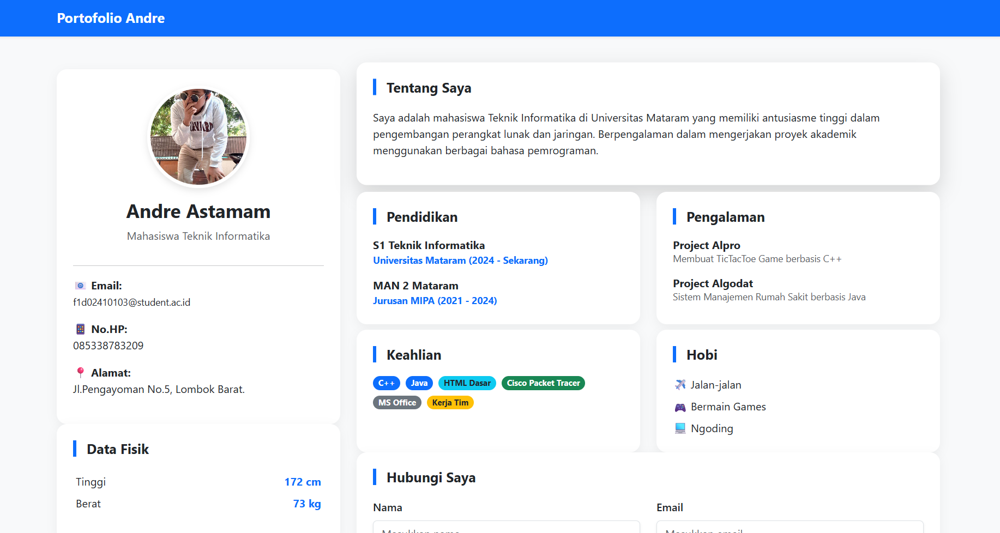

# T2-CSS-WEEK5 F1D02410103
Tugas 2 -Pemrograman Web 
SS WEB: 

Secara garis besar, portofolio ini dibangun dengan pendekatan Hybrid Development: menggunakan Bootstrap 5 untuk efisiensi struktur dan Custom CSS untuk estetika serta interaksi mikro.

1. Struktur Layout (The Framework)
Saya menggunakan Grid System Bootstrap (container, row, col) untuk memastikan tampilan web bersifat responsive.

Penempatan konten dibagi menjadi dua bagian (Sidebar dan Main Content) yang otomatis menyesuaikan diri (stacking) saat dibuka di perangkat mobile.

2. Estetika & Visual (The Custom CSS)
Bagian ini adalah nyawa dari tampilan portofolio, di mana saya menuliskan aturan CSS khusus untuk memberikan identitas visual:

Box Modeling: Penggunaan .card dengan border-radius besar dan box-shadow halus memberikan kesan modern dan bersih.

Typography Accent: Memberikan aksen border-left pada judul section sebagai visual cue agar pengguna lebih mudah memindai informasi penting.

Image Styling: Menggunakan object-fit: cover untuk memastikan foto profil tetap proporsional tanpa distorsi pada berbagai ukuran layar.

3. Interaksi Mikro (Hover & Animations)
Untuk meningkatkan User Experience (UX), saya menambahkan interaksi menggunakan properti CSS3:

Transition & Transform: Setiap elemen interaktif (seperti kartu dan tombol) dibekali properti transition. Saat kursor menyentuh elemen tersebut (hover), elemen akan melakukan transform: translateY (melayang ke atas). Ini memberikan feedback instan kepada pengguna bahwa elemen tersebut bersifat interaktif.

Depth Perception: Perubahan intensitas box-shadow saat kondisi hover menciptakan kedalaman visual (efek 3D), membuat elemen seolah-olah terangkat dari permukaan halaman.

Scale Animation: Digunakan pada foto profil dan badge keahlian untuk memberikan kesan dinamis dan tidak kaku.
